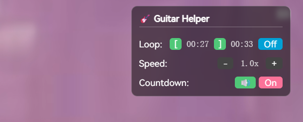

# Bilibili Guitar Helper 🎸

A powerful userscript for Bilibili designed to assist guitarists and musicians in practicing with video tutorials. It provides precise looping, slow-motion playback, and a preparation countdown.



## Features

### 🔄 Advanced Looping
- Set a custom **Loop Start** and **Loop End** point by clicking buttons or using shortcuts.
- Visual feedback with emerald green buttons and formatted timestamps (`MM:SS`).
- Toggle looping on/off instantly.

### ⏳ Persistent Countdown Toggle
- **Toggle Mode**: Use `c` or the UI button to toggle the countdown feature on/off.
- **Auto-Trigger**: If enabled, the countdown triggers **every time** the video starts/resumes (e.g., pressing Space) or **loops back** to the start point.
- **Auto-Seek**: If **Loop is On**, the script automatically seeks to your loop start point before counting down. If **Loop is Off**, the countdown happens at the current position.

### 🐌 Precise Playback Speed
- Adjust speed from **0.5x to 1.0x** in fine-grained **0.1 increments**.
- Perfect for slowing down complex solos or riffs.

### 🖥️ Modern UI Overlay
- Sleek, semi-transparent "Glassmorphism" UI in the top-right corner.
- Remains visible even in **Fullscreen** mode.

---

## Keyboard Shortcuts

| Action | Key |
| :--- | :--- |
| **Set Loop Start** | `[` |
| **Set Loop End** | `]` |
| **Toggle Loop** | `l` |
| **Start Countdown** | `c` |
| **Speed Down** | `-` |
| **Speed Up** | `+` (or `=`) |

---

## Installation

### For Users
1. Install a userscript manager like [Tampermonkey](https://www.tampermonkey.net/).
2. **[Click here to Install the Script](https://github.com/charlee/bilibili-guitar-helper/raw/refs/heads/master/src/index.user.js)**.
3. Refresh any Bilibili video page.

### For Local Development
1. Enable "Allow access to file URLs" in Tampermonkey's extension settings.
2. Create a "Stub" script in Tampermonkey with the following metadata:
   ```javascript
   // ==UserScript==
   // @name         Bilibili Guitar Helper (Dev)
   // @match        *://*.bilibili.com/video/*
   // @match        *://*.bilibili.com/bangumi/play/*
   // @require      file:///YOUR_LOCAL_PATH/src/index.user.js
   // ==/UserScript==
   ```
3. Edit the file in your favorite editor and refresh Bilibili to see changes!
